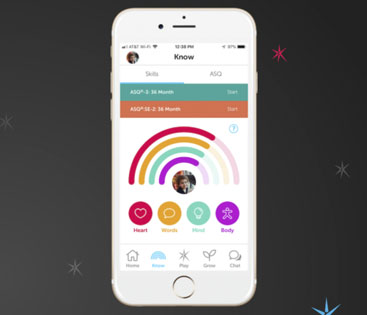

## Portfolio

---

### Commercial work

[Sparkler](https://www.playsparkler.org)
 

 
Mobile app development for native iOS and Android. Mostly Android.

---
[Scompler](https://scompler.com)
 

 
Mobile app development in Flutter. MobX as State Managment.

---
[Other little things on Upwork](https://www.upwork.com/freelancers/ivanterekhin)
 
Mobile app development in Flutter, Android, Unity. Various smaller projects on Upwork place.

---

### Personal projects, links

- [WinGym](https://clover-republic.com/) (more than 200k downloads on all platforms)
- [Chopper](https://github.com/lejard-h/chopper) (co-maintainer of popular lib for Flutter)
- [Github](https://github.com/JEuler) (A+ profile page)
- [Medium](https://medium.com/@jeuler) (A blog on Medium about Mobile and Tech things)
- [Upwork](https://www.upwork.com/freelancers/ivanterekhin) (Profile page on Upwork)

---

---

Page template forked from <a href="https://github.com/evanca/quick-portfolio">evanca</a>

<!-- Remove above link if you don't want to attibute -->
